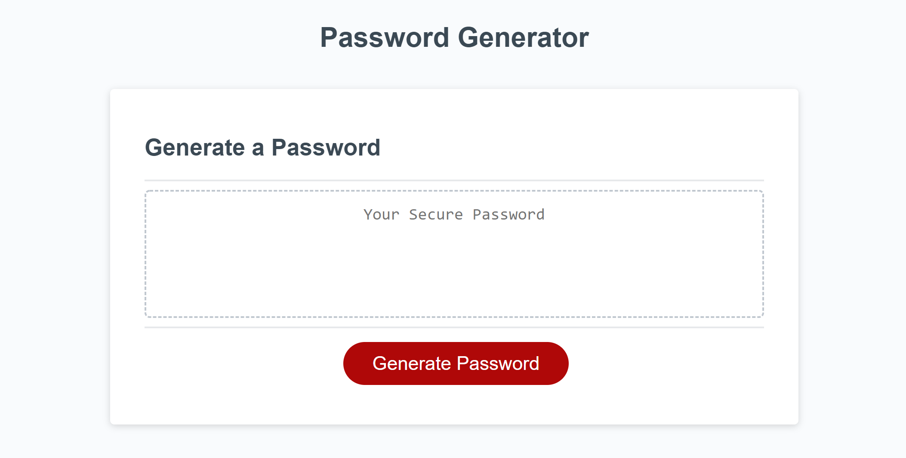

# Password Generator Starter Code
This code is design to create a random password by providing the user character types.
It also makes the user pick how long the password is going to be.

# Preview

If you want to give it a try go ahead press [here](https://mochiwaves.github.io/tongue-twister/)
